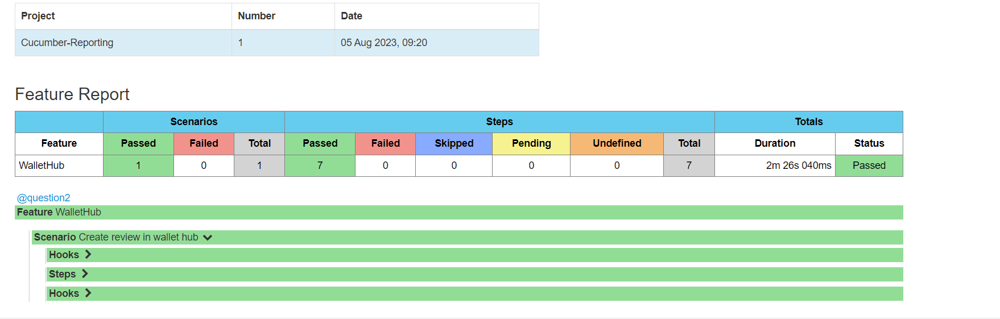

# selenium_BDD_framework

Behavioural driven development automation framework using selenium, cucumber-java, testng, maven, phantomjs

## Tools and technologies used:

1. Language: Java 8
2. Testing framework: Testng
3. BDD framework: Cucumber jvm
4. Automation tool: Selenium webdriver
5. Build tool: maven
6. Logging: log4j
7. Headless browser: Phantomjs
8. Reporting: [cucumber reporting](https://github.com/damianszczepanik/cucumber-reporting)

## Features of the framework
1. BDD framework using Cucumber-jvm. Feature files can be written easily using Given,When, Then etc.
2. Browser(chrome/firefox) can be configured at run time  from command line (or Continuous integration tool, if configured).
3. Tests can run in headless browser (Phantomjs) by passing a parameter at run time.
4. Screenshot would be taken if any scenario failed and saved under /outputFiles folder.
5. Html report gets generated after each test run and can be found /target/cucumber-html-report/index.html

## Test report ##

Once test execution is completed, go to target/cucumber-report folder and open feature-overview.html file

You can see the test results at different level

# Setting up the project

Install the maven and clone the build then:

**$ cd walletHubAssignment**

**$ mvn clean install**

## Execution of tests  
There are 2 scenarios named as @scenario1 and @scenario2. Ran the tests on chrome54.0, firefox46 on ubuntu 14.04 64 bit

To run both scenarios (@question1 and @question2) (by default browser would be chrome):

**$ mvn test**
